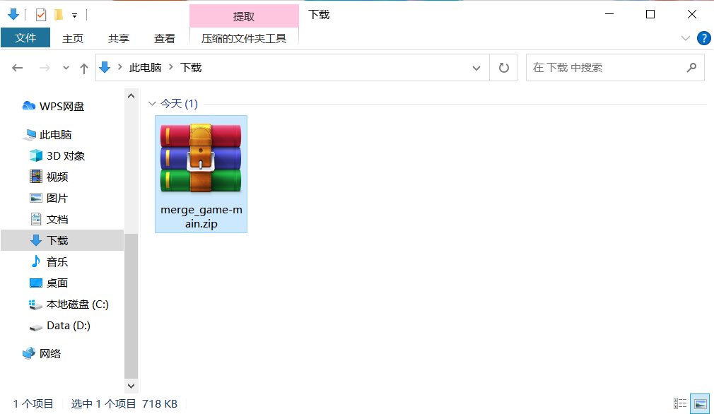
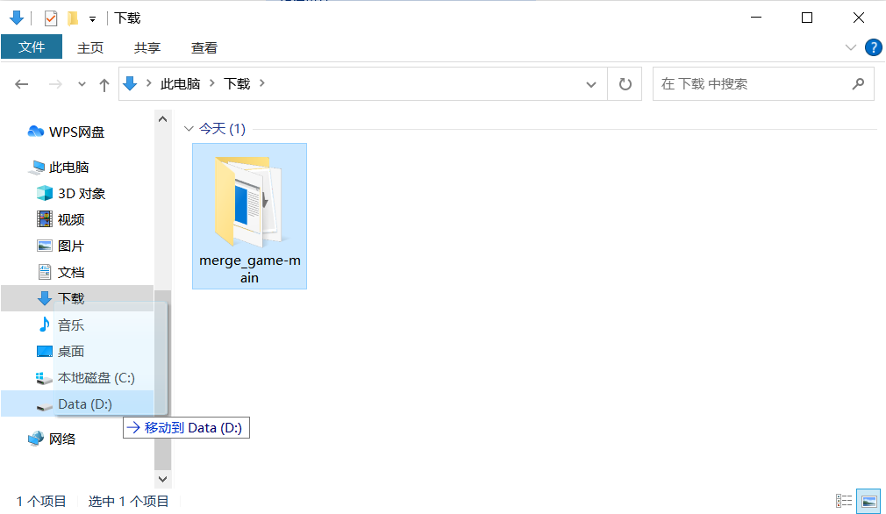
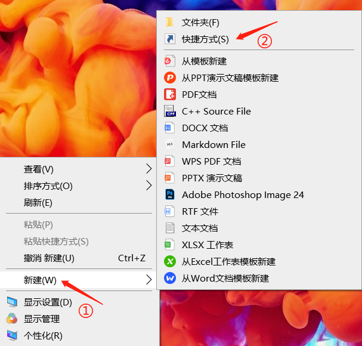
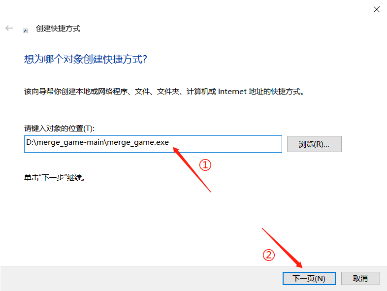
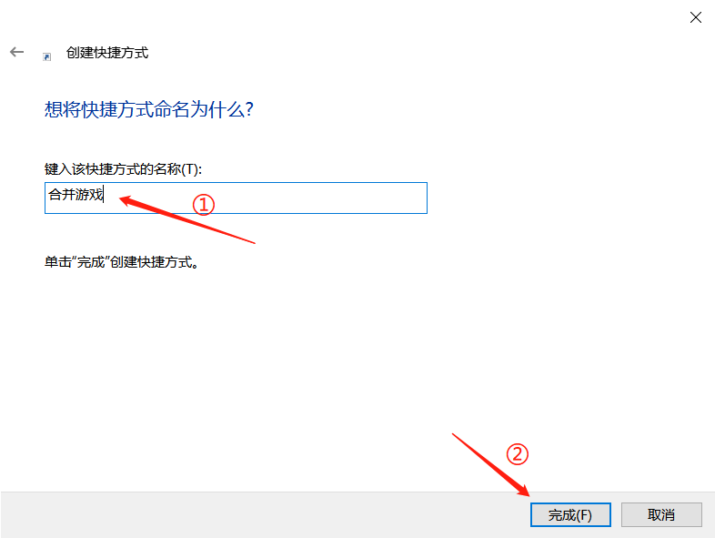
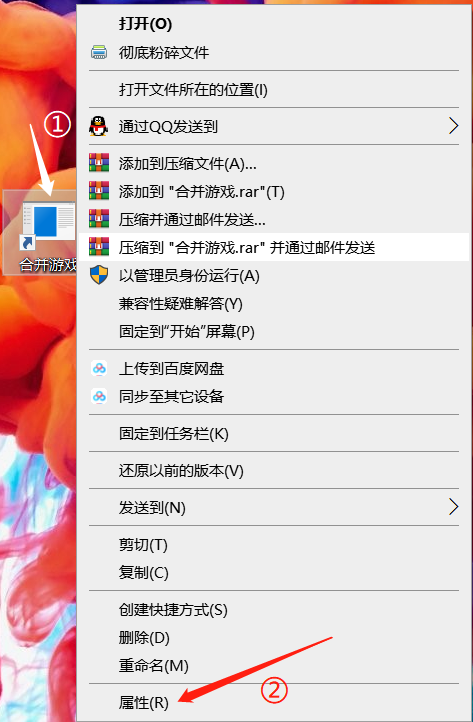
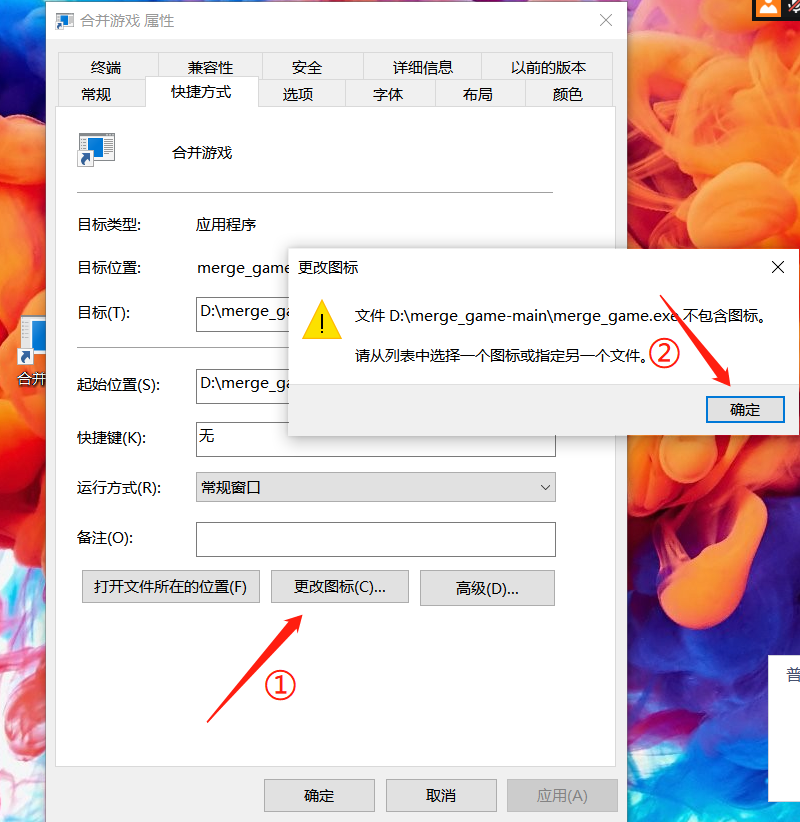
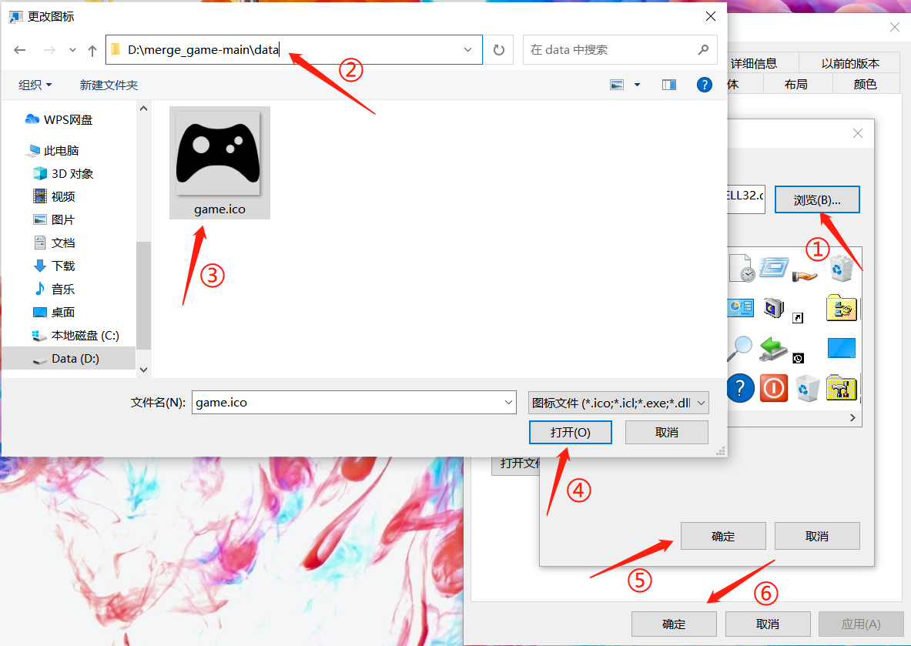

## 安装说明

#### 1. 找到压缩包下载位置，用解压缩软件解压到当前下载目录

>  

#### 2. 将解压后的文件夹移动到 `D:\` 目录

>  

#### 3. 在桌面新建快捷方式（地址为 `D:\merge_game-main\merge_game.exe`）

>    

#### 4. [可选]更改图标（地址为 `D:\merge_game-main\data\game.ico`）

>   